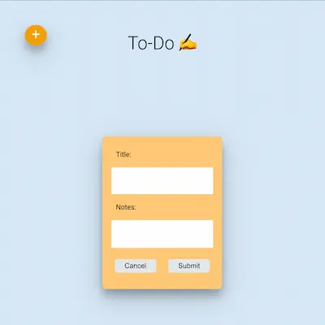

The To-Do app also includes an edit feature that allows users to modify tasks after completion, a completed feature to toggle completion of a task, as well as a delete button that allows users to remove completed tasks from the list.

The use of React, Express middleware, Node.js, and MySQL database make this app scalable and robust. Additionally, the colorful and engaging design makes managing tasks a more enjoyable experience.

We hope you find the To-Do app useful and fun to use! If you have any questions or feedback, please don't hesitate to reach out to us.

## To-Do

Welcome to To-Do! This is a web application built with React, Express middleware, Node.js, and a MySQL database that allows users to create, manage, and prioritize their daily tasks in a colorful and engaging way.

## Project Status
Deployed at [https://todofe.onrender.com/](https://todofe.onrender.com/)

## Project Screenshot

## Installation and Setup Instructions

To get started with the app, first make sure you have Node.js and MySQL installed on your local machine. Then, clone this repository and run npm install in the root directory to install all the necessary dependencies.

Next, create a MySQL database and configure the connection settings in the server.js file. You can use the schema.sql file to create the necessary tables and columns for the database.

Once you have set up the database, you can start the app by running npm run dev. This will launch the app in your default browser at http://localhost:3000/.

To use the app, simply enter a task in the input field and press the "Add" button. The task will be added to the list with a randomly generated color. You can then drag and drop the tasks to prioritize them, or click on a task to mark it as completed.

## Reflection

The project objective is to design and develop a colorful to-do app with a REST API that allows users to perform full CRUD operations (Create, Read, Update, Delete) on their to-do list items. The app should have an intuitive user interface with vibrant colors and an easy-to-use interface that enables users to create and manage their to-do list seamlessly. The REST API should be built using industry-standard best practices and allow for secure communication between the client-side and server-side components of the app. Additionally, the app should be designed to handle large volumes of data and be scalable to accommodate future growth.

One of the main challenges I ran into was styling the to-do cards in a responsive and usable way while keeping with a playful, colorful aesthetic. Additionally, carrying endpoints from development to production and deployment was a valuable learning process, including finding reliable hosting resources for a full stack application.            
                                                    
--Chelsea Avery--    
📫 chelseaavery.js@gmail.com    
🐙 https://github.com/chelseaerinavery     
💼 https://www.linkedin.com/in/chelseaavery/     
👩‍💻 [chelsea-avery.netlify.app](chelsea-avery.netlify.app)    